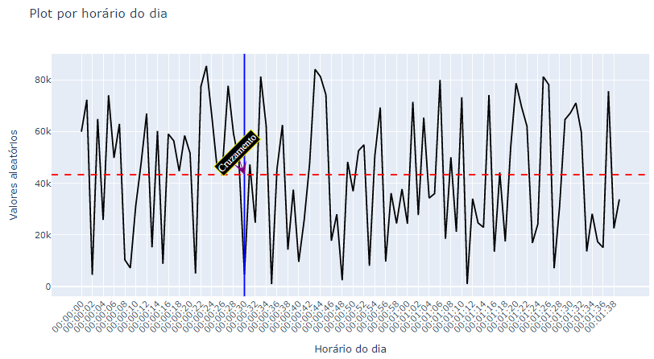
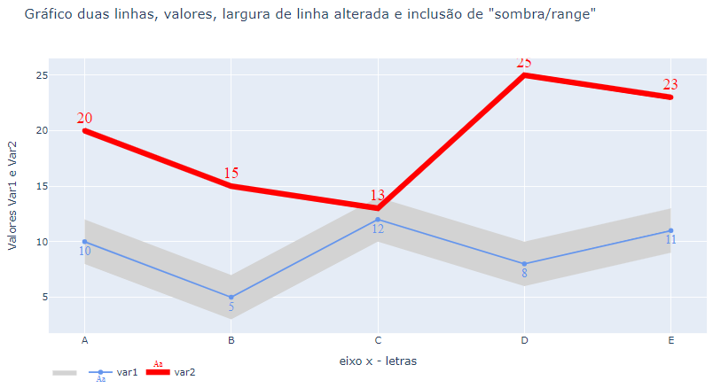
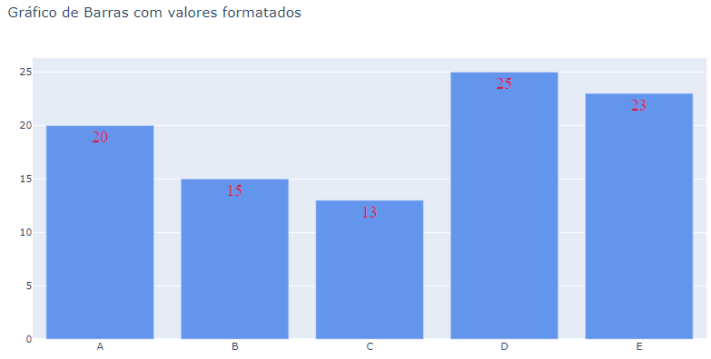

# PLOTLY

## Tópicos 

[Descrição](#Descrição)

[Estrutura do Diretório](#Estrutura-do-Diretório)

[Ferramentas utilizadas](#Ferramentas-utilizadas)


## Descrição

Diretório só para brincar com algumas visualizações utilizando o plotly.
https://plotly.com/python/

Exemplos:




## Estrutura do Diretório
```

```

## Ferramentas utilizadas

* Jupyter notebook