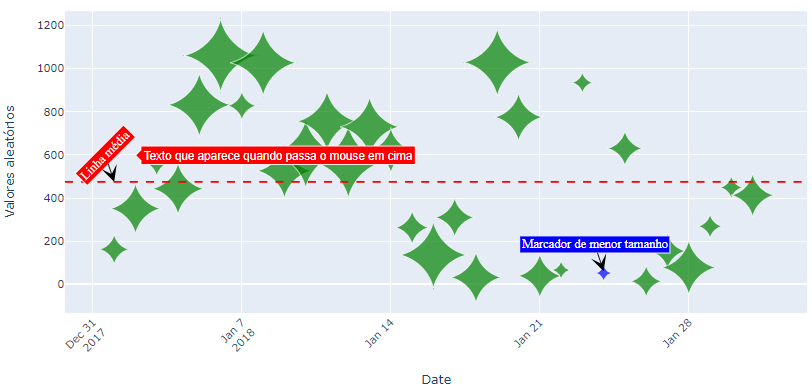
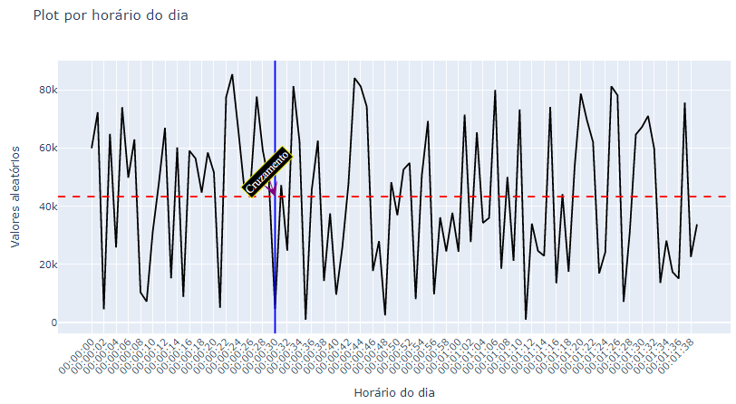
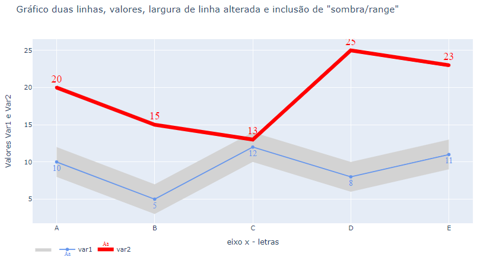
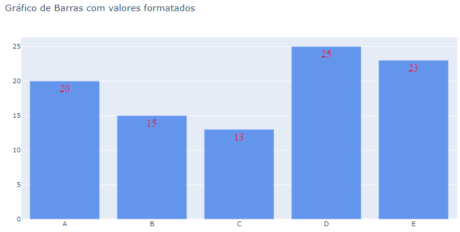

# PLOTLY

## Tópicos 

[Descrição](#Descrição)

[Estrutura do Diretório](#Estrutura-do-Diretório)

[Ferramentas utilizadas](#Ferramentas-utilizadas)


## Descrição

Diretório só para brincar com algumas visualizações utilizando o plotly.
https://plotly.com/python/

Exemplos:





## Estrutura do Diretório
```
│   Bar Plotly.ipynb
│   bubble plot.ipynb
│   Line plot.ipynb
│   Plot por horário do dia.ipynb
│   dcalendariotime.xlsx
│   dcalendário.xlsx
│   README.md
│
└───prints_figs
        bar_plot.png
        bubble_plot.png
        line_plot.png
        plot_hora_dia.png
```
## Ferramentas utilizadas
* Jupyter notebook